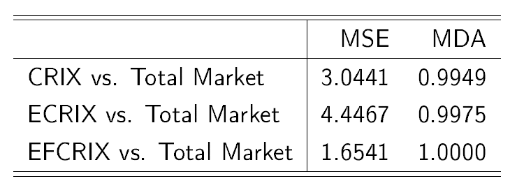

[](http://quantlet.de/index.php?p=info)

## [](http://quantlet.de/) **CRIXfamdiffloss** [](http://quantlet.de/d3/ia)

```yaml
Name of Quantlet : CRIXfamdiffloss

Published in : 'CRIX - a CRyptocurrency IndeX'

Description : CRIXfamdiffloss gives a table which shows the Mean Squared Error (MSE) and the Mean
Directional Accuracy (MDA) of the indices CRIX, ECRIX and EFCRIX compared to the total market.

Keywords : - CRIX - ECRIX - EFCRIX - index - cryptocurrency - crypto - plot - MSE - MDA

See also : - CRIXindex - ECRIXindex - EFCRIXindex - CRIXfamdiff - DAXCRIXloss - CRIXhnoptions -
CRIXoutmarket - CRIXoutmarketTERES - CRIXvarreturn

Author : Simon Trimborn

Submitted : Fri, December 12 2015 by Simon Trimborn

Datafile : - crix.csv - ecrix.csv - efcrix.csv - crix_all.csv

Example : Table of the MSE and MDA of CRIX, ECRIX, EFCRIX compared to the total market.
```




```r
rm(list = ls(all = TRUE))
graphics.off()

# please change your working directory 
# setwd('C:/...')

crix        = read.csv("crix.csv", header = FALSE)
crix_all    = read.csv("crix_all.csv", header = FALSE)
ecrix       = read.csv("ecrix.csv", header = FALSE)
efcrix      = read.csv("efcrix.csv", header = FALSE)
crix$V1     = as.character(crix$V1)
crix_all$V1 = as.character(crix_all$V1)
ecrix$V1    = as.character(ecrix$V1)
efcrix$V1   = as.character(efcrix$V1)

mse_crix_totalmarket   = mean((crix_all[, 2] - crix[, 2])^2)
mda_crix_totalmarket   = mean(sign(diff(crix_all[, 2])) == 
    sign(diff(crix[, 2])))
mse_ecrix_totalmarket  = mean((crix_all[, 2] - ecrix[, 2])^2)
mda_ecrix_totalmarket  = mean(sign(diff(crix_all[, 2])) == 
    sign(diff(ecrix[, 2])))
mse_efcrix_totalmarket = mean((crix_all[, 2] - efcrix[, 2])^2)
mda_efcrix_totalmarket = mean(sign(diff(crix_all[, 2])) == 
    sign(diff(efcrix[, 2])))
matrix_mse_mda         = matrix(round(c(mse_crix_totalmarket, 
    mse_ecrix_totalmarket, mse_efcrix_totalmarket, mda_crix_totalmarket, 
    mda_ecrix_totalmarket, mda_efcrix_totalmarket), 4), ncol = 2, byrow = FALSE, 
    dimnames = list(c("CRIX vs. Total Market", "ECRIX vs. Total Market", 
    "EFCRIX vs. Total Market"), c("MSE", "MDA")))
matrix_mse_mda

```
