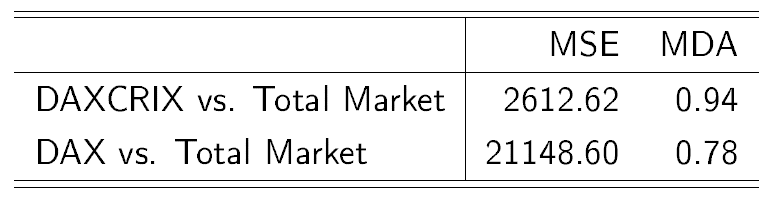

[](http://quantlet.de/index.php?p=info)

## [](http://quantlet.de/) **DAXCRIXloss** [](http://quantlet.de/d3/ia)

```yaml

Name of Quantlet : DAXCRIXloss

Published in :  'CRIX - a CRyptocurrency IndeX'

Description : DAXCRIXloss gives a table which shows the Mean Squared Error (MSE) and the Mean Directional Accuracy (MDA) of the indices DAX and DAXCRIX compared to the total market.

Keywords : 
 - CRIX
 - ECRIX
 - EFCRIX
 - DAX
 - DAXCRIX
 - index
 - cryptocurrency
 - crypto
 - plot
 - MSE
 - MDA

See also : 
 - CRIXindex
 - ECRIXindex
 - EFCRIXindex
 - CRIXfamdiff
 - CRIXfamdiffloss
 - CRIXhnoptions
 - CRIXoutmarket
 - CRIXoutmarketTERES
 - CRIXvarreturn

Author : Simon Trimborn

Submitted :  Fri, December 12 2015 by Simon Trimborn

Datafile : 
 - daxcrix.csv
 - DAXcsv.csv
 - totalmarket.csv

Example : Table of the MSE and MDA of DAX and DAXCRIX compared to the total market.
```




```r
rm(list = ls(all = TRUE))
graphics.off()

# please change your working directory 
# setwd('C:/...')

dax         = read.csv("DAXcsv.csv", sep = ";", dec = ",", header = FALSE)
daxcrix     = read.csv("daxcrix.csv", sep = ",", dec = ".", header = FALSE)
totalmarket = read.csv("totalmarket.csv", sep = ",", dec = ".", header = FALSE)

date_dax        = as.Date(dax[, 1], format = "%d.%m.%Y")
date_daxcrix    = as.Date(daxcrix[, 1], origin = "1970-01-01")
divisor_dax     = dax[which(date_dax == date_daxcrix[1] - 3), 2] / 1000
dax_rescaled    = dax[c(which(date_dax == date_daxcrix[1]):which(date_dax == 
    tail(date_daxcrix, n = 1))), 2] / divisor_dax
daxcrix_analyze = daxcrix[, 2]

mse_daxcrix_daxcrixall = mean((totalmarket[, 2] - daxcrix_analyze)^2)
mda_daxcrix_daxcrixall = mean(sign(diff(totalmarket[, 2])) == 
    sign(diff(daxcrix_analyze)))
mse_dax_daxcrixall = mean((totalmarket[, 2] - dax_rescaled)^2)
mda_dax_daxcrixall = mean(sign(diff(totalmarket[, 2])) == 
    sign(diff(dax_rescaled)))
matrix_mse_mda = matrix(round(c(mse_daxcrix_daxcrixall, mse_dax_daxcrixall, 
    mda_daxcrix_daxcrixall, mda_dax_daxcrixall), 2), ncol = 2, byrow = FALSE, 
    dimnames = list(c("DAXCRIX vs. Total Market", "DAX vs. Total Market"), 
    c("MSE", "MDA")))
matrix_mse_mda
```
