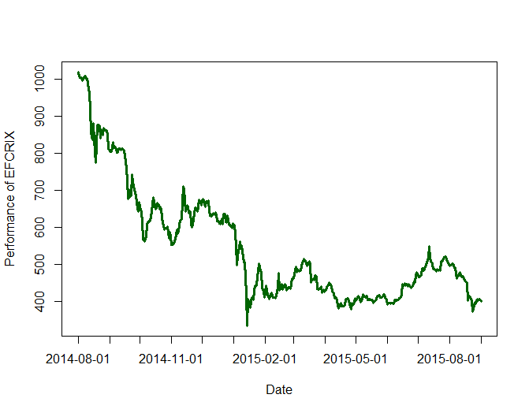

[](http://quantlet.de/index.php?p=info)

## [](http://quantlet.de/) **EFCRIXindex** [](http://quantlet.de/d3/ia)

```yaml

Name of Quantlet : EFCRIXindex

Published in : CRIX or evaluating blockchain based currencies

Description : 'Gives a plot which shows the performance of the cryptocurrency index EFCRIX. The
data were calculated with CRIXcode.R.'

Keywords : CRIX, ECRIX, EFCRIX, index, cryptocurrency, crypto, plot

See also : 'CRIXindex, ECRIXindex, CRIXfamdiff, CRIXfamdiffloss, DAXCRIXloss, CRIXhnoptions,
CRIXoutmarket, CRIXoutmarketTERES, CRIXvarreturn'

Author : Simon Trimborn

Submitted : Mon, May 30 2016 by Simon Trimborn

Datafile : efcrix.RData

Example : Plot with the EFCRIX.

```




### R Code:
```r
rm(list = ls(all = TRUE))
graphics.off()

# please change your working directory 
# setwd('C:/...')

load("efcrix.RData")

plot(efcrix, type = "l", col = "darkgreen", xaxt = "n", lwd = 3, xlab = "Date", 
     ylab = "Performance of EFCRIX")
axis(1, at = c(2,94,186,275,367,459,551), label = names(efcrix)[c(2,94,186,275,367,459,551)])

```
